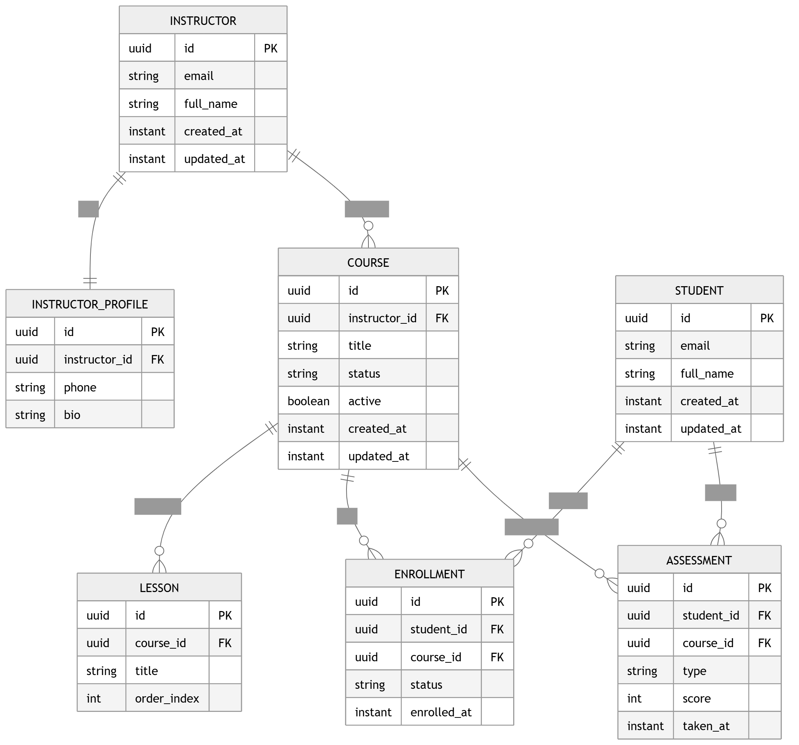

# LMS - Learning Management System

Este proyecto consiste en una **API REST** desarrollada con **Spring Boot 3.4** para la gestión de una plataforma de aprendizaje en línea. Permite administrar estudiantes, instructores, cursos y el seguimiento del progreso académico a través de evaluaciones.

## Arquitectura del Proyecto

El sistema sigue una arquitectura por capas, garantizando el desacoplamiento y la escalabilidad:
- **Domain Layer:** Entidades JPA y Repositorios.
- **Service Layer:** Lógica de negocio e interfaces.
- **API Layer:** DTOs (Records), Mappers manuales y Controladores REST.

---

## Modelo de Datos

A continuación se presenta el diagrama de entidad-relación que representa la arquitectura de la base de datos:



### Relaciones Clave:
- **Instructor (1:1) InstructorProfile**: Información biográfica detallada por instructor.
- **Course (1:N) Lesson**: Los cursos se dividen en lecciones ordenadas.
- **Enrollment (N:M)**: Relación entre Estudiantes y Cursos con seguimiento de estado.
- **Assessment**: Registro de calificaciones por curso y estudiante.

---

## 🛠️ Tecnologías Utilizadas

- **Java 21**
- **Spring Boot 4.0.3** (Starter Data JPA, Validation, Web)
- **PostgreSQL** (Base de datos de producción)
- **Lombok** (Reducción de código boilerplate)
- **JUnit 5 & Mockito** (Pruebas unitarias de servicios)
- **Testcontainers** (Pruebas de integración con PostgreSQL real)

---

## 🚀 Instalación y Configuración

### Requisitos previos
- JDK 21
- Maven 3.9+
- Docker (Para ejecutar los Testcontainers)

### Pasos para ejecutar:
1. Clonar el repositorio:
   ```bash
   git clone [https://github.com/tu-usuario/LMS-Spring.git](https://github.com/tu-usuario/LMS-Spring.git)